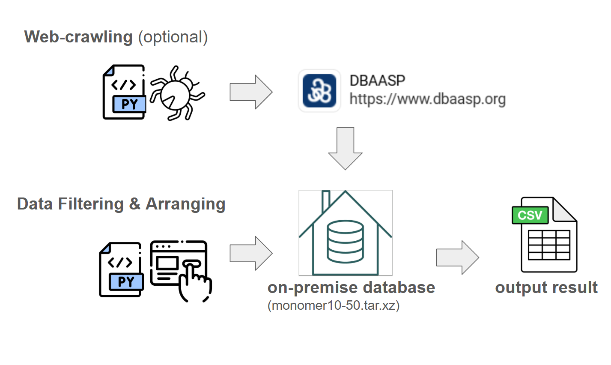
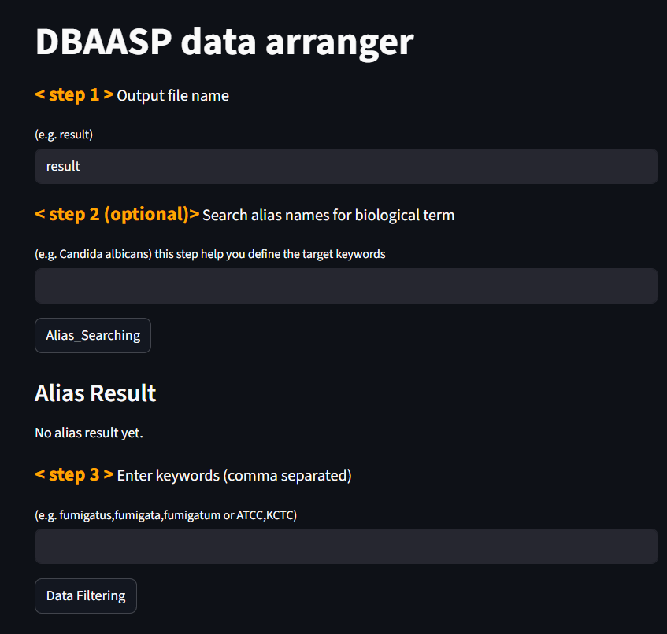
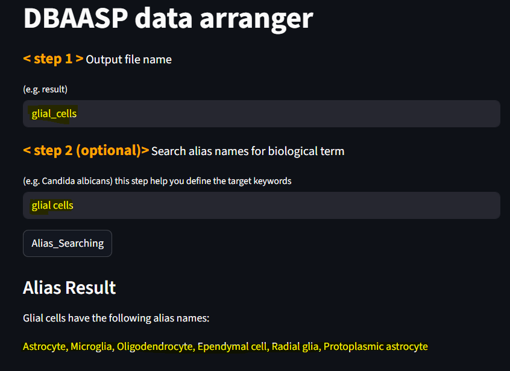
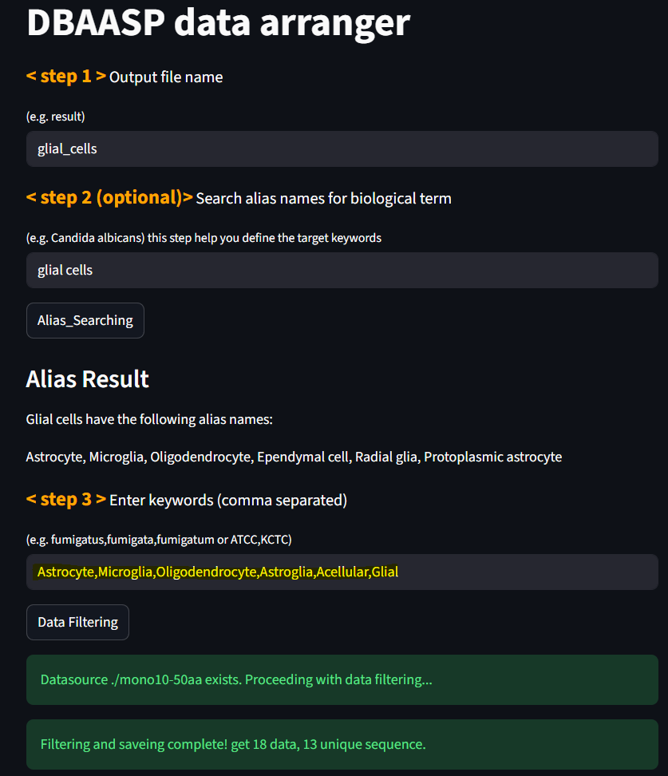

## dbaasp-crawler

fetching and arranging peptide samples from DBAASP database
<p align="center">
  
</p>

---


### Step by step download this repo

1. prepare environment with recommended python 3.11.7, streamlit 1.51.0, selenium 4.38.0, requests 2.32.5<br>


2. recommend download by wget:
```bash
wget https://github.com/Lee-ChinCheng/dbaasp-crawler/archive/refs/heads/main.zip
```

3. decompress the zip file:
```bash
unzip main.zip
```

4. access the repo folder:
```bash
cd dbaasp-crawler-main
```

5. decompress monomer10-50.tar.xz. This will produce a directory with multiple CSV files, all of which were previously web-crawling results.
```bash
tar -xf monomer10-50.tar.xz
```
6. execute step1_arrange.py, it will pop up a UI for user inputs.
```bash
streamlit run step1_arrange.py
```

7. input saving file name in user interface ( default is "result" )

Initial UI:
<p align="center">
  
</p>

Optional: search biology alias by LLM ( aliasLLM.py ):
<p align="center">
  
</p>

8. Enter keywords corresponding to target cell types. Any peptide assay whose "Target Species" field contains at least one of these keywords will be retrieved.

<p align="center">
  
</p>

9. check search result in directory /output_csv

---
