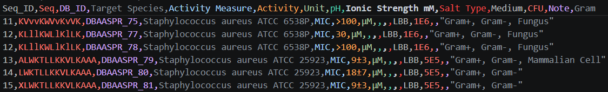
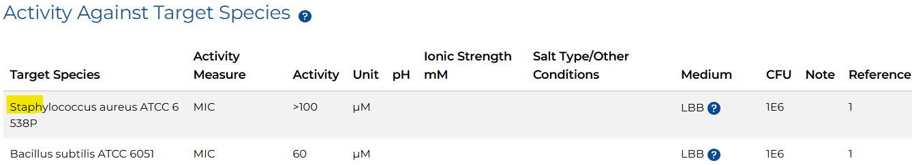

### Internal Team Tool: dbaasp-crawler
---
### Main Goal
Streamline access to peptide data from the DBAASP database by addressing its UI limitations in filtering key biological attributes (target cell types, concentration, gram types) to enhance team efficiency.

<p align="center">
  
</p>

---


### Step by step download this repo

1. prepare environment with recommended python 3.11.7, streamlit 1.51.0, selenium 4.38.0, requests 2.32.5, and LLM API key (default is llama3.1:8b in ghidorah server)<br>


2. recommend download by wget:
```bash
wget https://github.com/Lee-ChinCheng/dbaasp-crawler/archive/refs/heads/main.zip
```

3. decompress the zip file:
```bash
unzip main.zip
```

4. access the repo folder:
```bash
cd dbaasp-crawler-main
```

5. decompress mono10-50.tar.xz. This will produce a directory with multiple CSV files, all of which were previously web-crawling results.
```bash
tar -xf mono10-50.tar.xz
```
6. execute step1_arrange.py, it will pop up a UI for user inputs.
```bash
streamlit run step1_arrange.py
```

7. input saving file name in user interface ( default is "result" )

Initial UI:
<p align="center">
  
</p>

Optional: search biology alias by LLM ( aliasLLM.py ):
<p align="center">
  
</p>

8. Enter keywords corresponding to target cell types. Any peptide assay whose "Target Species" field contains at least one of these keywords will be retrieved.

<p align="center">
  
</p>

9. check search result in directory /output_csv<br> 
and the output csv format as below

<p align="center">
  
</p>


the sample KVvvKWVvKvVK (Seq_ID: 11) maps the assay information on https://www.dbaasp.org/peptide-card?id=DBAASPR_75
<p align="center">
  
</p>


---

### algorithm
Currently uses substring search (pattern matching) to identify target cell types based on keyword queries. Further optimizations are planned for future releases.

```bash
text = "Fathead minnow muscle cells (FHM)"
kw1 = "cell"
kw2 = "muscles"
print(kw1 in text) #True
print(kw2 in text) #False
```
