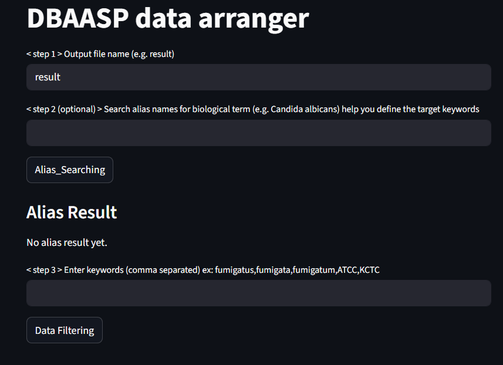
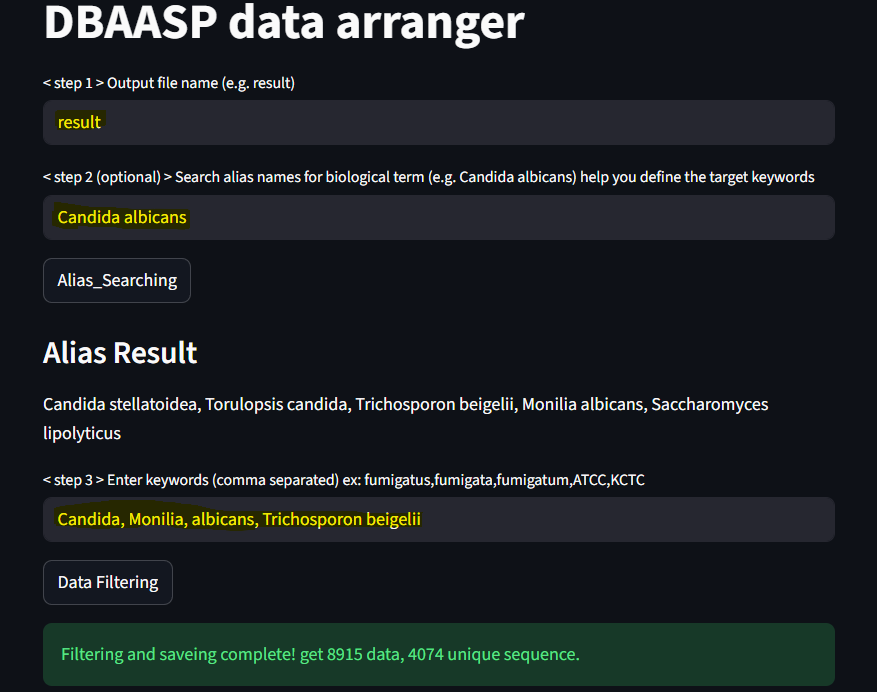

## dbaasp-crawler

fetching and arranging peptide samples from DBAASP database
<p align="center">
  
</p>

---


### Step by step download this repo

1. prepare environment with recommended python 3.11.7, streamlit 1.51.0, selenium 4.38.0, requests 2.32.5


2. recommend download by wget:
```bash
wget https://github.com/Lee-ChinCheng/dbaasp-crawler/archive/refs/heads/main.zip
```

3. decompress the zip file:
```bash
unzip main.zip
```

4. access the repo folder:
```bash
cd dbaasp-crawler-main
```

5. decompress monomer10-50.tar.xz. This will produce a directory with multiple CSV files, all of which were previously web-crawling results.
```bash
tar -xf monomer10-50.tar.xz
```
6. execute step1_arrange.py, it will pop up a UI for user inputs.
```bash
streamlit run step1_arrange.py
```

7. input required parameters in user interface

Initial UI:
<p align="center">
  
</p>

Input parameters and run:
<p align="center">
  
</p>


---
